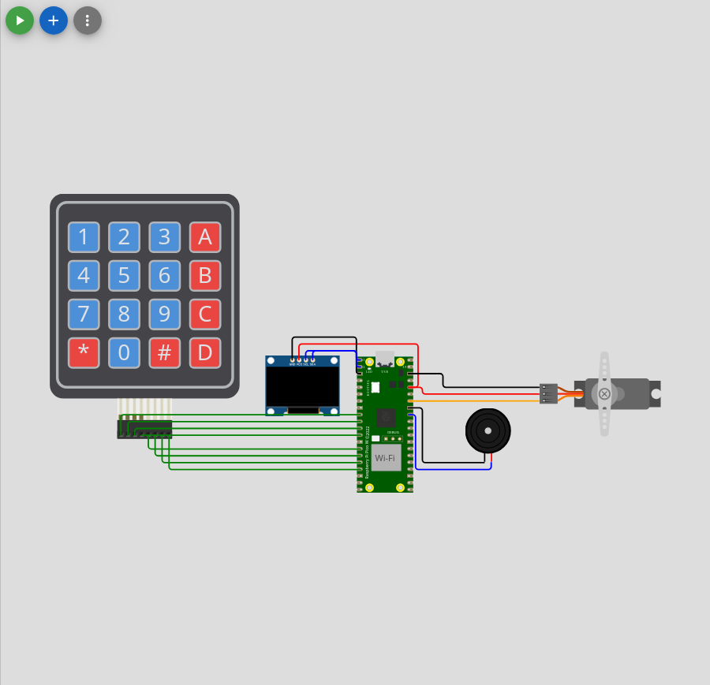
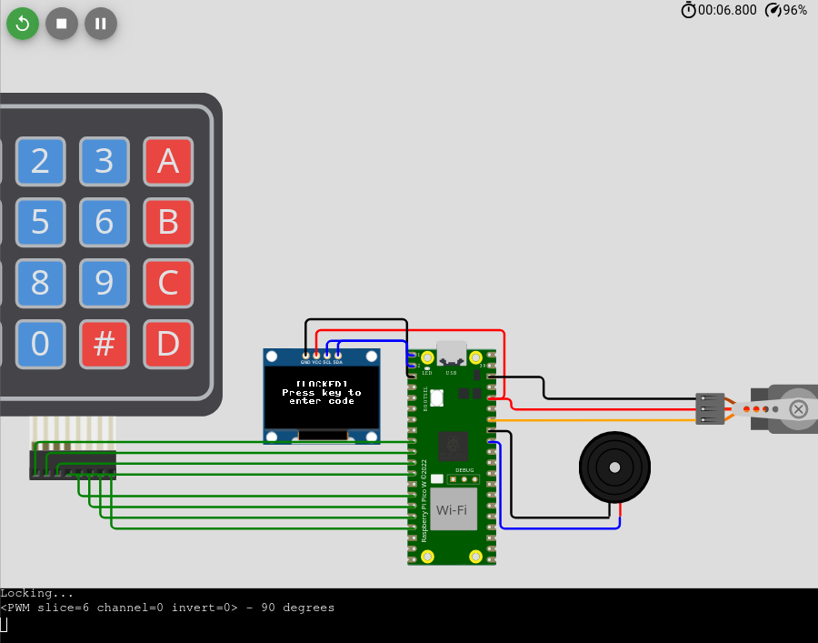

# PicoLock

This project is a lock system for the Raspberry Pi Pico, implemented in MicroPython. It uses a combination of a servo motor, a keypad, a buzzer, and an SSD1306 display to provide a secure and interactive locking mechanism.

[Wokwi](https://wokwi.com/projects/405505323975956481)

## Components

- **Raspberry Pi Pico**: Microcontroller
- **Servo Motor**: For locking and unlocking
- **Keypad**: For entering the access code
- **Buzzer**: For sound notifications
- **SSD1306 Display**: For showing status and prompts

## Overview

The lock system provides a way to control a lock via a servo motor. Users can interact with the system through a keypad to enter a predefined code. The SSD1306 display shows prompts and status messages, while the buzzer provides audio feedback. 

The system features:
- Lock and unlock functionality controlled by a servo motor.
- Code entry with up to 3 attempts before locking out for a predefined time.
- Autolock feature that locks the system after a predefined length of inactivity.
- Visual feedback on the SSD1306 display.
- Audio feedback through the buzzer.

## Installation

### Hardware Setup

1. **Connect the Servo Motor**:
   - Connect the servo control wire to a PWM-capable pin on the Raspberry Pi Pico.

2. **Connect the Keypad**:
   - Connect the keypad rows and columns to available GPIO pins.

3. **Connect the Buzzer**:
   - Connect the buzzer to a GPIO pin.

4. **Connect the SSD1306 Display**:
   - Connect the display’s SDA and SCL pins to the corresponding I2C pins on the Raspberry Pi Pico.
   - Use a 400kHz I2C frequency for communication.

5. **Define Pins in `pins.py`**:
   - Define the pin assignments in the `pins.py` file. Ensure that your pin definitions match the connections you've made.

### Software Setup

1. **Install MicroPython**: 
   - Ensure MicroPython is installed on your Raspberry Pi Pico. Follow the [official guide](https://www.raspberrypi.com/documentation/microcontrollers/micropython.html) if needed.

2. **Upload the Code**:
   - Use a tool like Thonny to upload the provided MicroPython scripts to your Pico.

3. **Dependencies**:
   - Make sure you have the `ssd1306` library available in your MicroPython environment. You can typically find this library in the MicroPython package repository or online resources.

## Images

## `pins.py`

`pins.py` contains the pin definitions for connecting the hardware components:
Please ensure that the pin assignments match your hardware setup.

## Troubleshooting

- **Display Issues**: Ensure the I2C connections are correct and the `ssd1306` library is installed.
- **Keypad Not Responding**: Verify the keypad wiring and GPIO pin assignments.
- **Servo or Buzzer Not Working**: Check the connections and ensure the pins are correctly defined in `pins.py`.

## License

This project is licensed under the MIT License.
